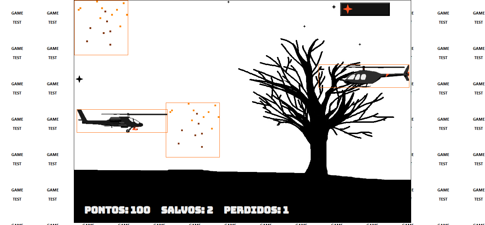
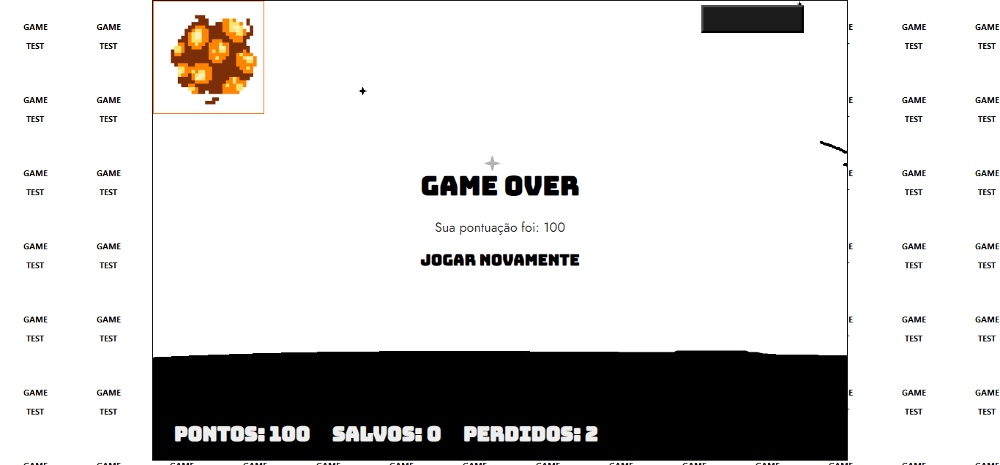

# Projeto realizado no Bootcamp Java Game Developer na Digital Innovation One 🏃🏻‍♂️🚁
Uma das dificuldades dos desenvolvedores de jogos é encontrar uma plataforma de desenvolvimento compatível com os diversos dispositivos móveis no mercado e também com os diferentes navegadores (browsers). Utilizando o HTML5 juntamente com as folhas de estilo CSS3 e o JavaScript, é possível desenvolver jogos de forma rápida e compatível com diversas plataformas, incluindo dispositivos móveis. No projeto são discutidas as etapas de desenvolvimento de jogos em HTML5, CSS3 e JavaScript do início ao fim, utilizando a didática passo a passo em seu desenvolvimento. Neste projeto, especificamente, os jogos serão publicados de forma que possam ser acessados via browser.


## Tecnologias 🚀
Esse projeto foi desenvolvido com as seguintes tecnologias:

- [Html](https://pt.wikipedia.org/wiki/HTML)
- [Css](https://pt.wikipedia.org/wiki/Cascading_Style_Sheets)
- [Javascript](https://pt.wikipedia.org/wiki/JavaScript)
- [Jquery](https://jquery.com/)

## Layout 🚧
#### Desktop Screenshot

https://github.com/Cleython-Enginner/jogo-nave-dio/blob/main/.github/inicio_jogo.png 
https://github.com/Cleython-Enginner/jogo-nave-dio/blob/main/.github/jogo_iniciado.png" 
https://github.com/Cleython-Enginner/jogo-nave-dio/blob/main/.github/partida.png" 


### Como jogar? 🕹
Você controla um helicóptero e seu objetivo é salvar seu parceiro e ganhar o máximo de pontos possíveis ô salvando e destruindo os inimigos pela frente.
*Conforme você vai avançando a dificuldade aumenta!*

#### Requisitos 😦
<!-- - Ter um dispositivo com o tamanho **minimo** de 950 x 630-->
- Acesso a um teclado

#### Regras 🧩
**Objetivo claro**: Salve seu parceiro e sobreviva o máximo que puder!

**Movimentação**: Você só consegue se movimentar para cima e para baixo.

**Salvamento**: Basta encostar seu helicóptero no personagem quando ele estiver passando para ele subir.
*+1 save*.

**Ataque**: Para atirar utilize a tecla 'seta para a direita →', basta um projétil para a destruição do inimigo.
*helicóptero inimigo: +100 pontos, caminhão: +50 pontos*.

**Colisões corpo a corpo**: O jogador perde -1 ponto de energia de (3) se colidir com o inimigo. No caso de seu parceiro se ele colidir com o inimigo ele é morto e o jogador tem que esperar seu renascimento.

**Vida**: O jogador tem vidas(energia), e só pode colidir 2 vezes com inimigo para sobreviver. *A terceira você perde...*

**Fim?**: Não existe fim até que voçê perca.

#### Desktop 💻✔
Helicóptero controlado no formato 'W, S, D'.  Use D para atirar.

#### Mobile 📱❌
*Não disponível*

## Rodando o projeto 🚴🏻‍♂️

# Clone o repositório
$ https://github.com/Cleython-Enginner/jogo-nave-dio
#### Projeto original modificado
$ git clone https://github.com/NyctibiusVII/TheDangerousRescue-AirWar.git

# Acesse a pasta do projeto no seu console
$ cd TheDangerousRescue

# Para executar o projeto basta abrir o html com seu navegador.
```

### BUG 🐞
**Bug visual**

1 Bug conhecido: Quando você atira ao mesmo tempo que seu helicóptero esta colidindo com o inimigo(frente a frente), a animação da explosão 'buga' e fica um sprite infinito na sua tela.




*Por enquanto a resolução para esse problema é recarregar a pagina caso não saia automaticamente quando você reiniciar o jogo.*

### OBS 👀
Esse projeto esta aqui para você brincar, aprender e modificar ao seu estilo gamer/programador. É um projeto pequeno mas ainda sim é ótimo para quem é iniciante começar a fuçar e modificar as coisas. Diverta-se 🎮

## Contribuição 💭
Para construir essa aplicação tive a ajuda do professor **Denilson Bonatti** da DigitalInnovationOne que disponibilizou video aulas do projeto **"Construindo o seu primeiro jogo de naves"**.

Se você esta querendo ajudar no projeto não deixe se 'forka', fazer suas alterações e dar pull 🎉. Eu ja agradeço muito por você esta aqui visualizando e lendo isso... Obrigado 🧡


